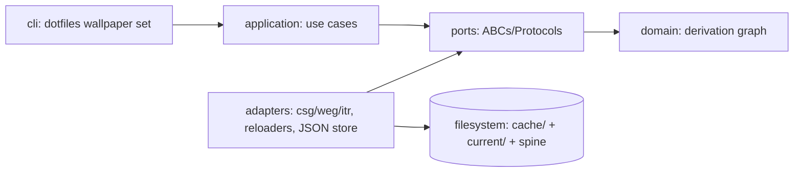

# Architecture Spine — dotfiles-repo-v3 Runtime Core (Phase 2)

## Design Paradigm

**Hexagonal architecture (ports & adapters), dependencies point inward** — the same paradigm provisioning already implements and mechanically enforces. The runtime core is a new hexagon under `src/runtime/src/runtime/{domain,ports,adapters,application,cli}`. Layer mapping:

| Layer | Namespace | Owns |
| --- | --- | --- |
| domain | `runtime.domain` | pure dataclasses/enums: derivation graph (WallpaperEntry, PaletteEntry, EffectsEntry, IconsEntry, MonitorWallpaperConfig), hashes, no I/O |
| ports | `runtime.ports` | ABCs/Protocols: `IWallpaperBackend`, `IStaticWallpaperBackend`, `IVideoWallpaperBackend`, `IColorSchemeGenerator`, `IEffectsGenerator`, `IIconRenderer`, `IDesktopConfigWriter`, `IDesktopReloader`, `IStateRepository`, `IWallpaperBackendFactory` |
| adapters | `runtime.adapters` | subprocess/FS/CLI wrappers, Hyprland/AGS/Hyprpaper/terminal reloaders, JSON file store, csg/weg/itr invokers, hardlink helper, wallpaper backends (HyprpaperBackend, SwaybgBackend, SwwwBackend, MpvpaperBackend), backend factory |
| application | `runtime.application` | use cases: `ApplyWallpaperUseCase`, `ReconcileDesktopStateUseCase`, `SeedCacheUseCase`, `InspectStateUseCase` |
| cli | `runtime.cli` | Typer app (root `dotfiles-runtime`), composition root, wallpaper/status/history/cache commands |

A **layered content-addressed cache** sits inside the hexagon's adapters/infrastructure: derived artifacts are stored once per derivation layer, keyed by the hash of all their inputs, and the desktop reads them through `current/` symlinks.

## Invariants & Rules

### AD-1 — Hexagonal architecture, dependencies point inward

- **Binds:** all runtime code
- **Prevents:** core depending on subprocess/FS/persistence detail
- **Rule:** `domain → ports → adapters → application → cli`, mechanically enforced by `tests/architecture/test_layering.py` mirroring provisioning's (domain stdlib allowlist, banned `subprocess`/`os`/`shutil`/`pathlib` in domain, no Path FS calls in domain, ports are ABCs).

### AD-2 — Layered content-addressed cache

- **Binds:** cache, persistence
- **Prevents:** stale-serving when templates/catalog/mappings change
- **Rule:** one cache level per derivation layer (`cache/wallpapers/`, `cache/palettes/`, `cache/effects/`, `cache/icons/`); each entry dir is named by the hash of ALL its derivation inputs, not just the wallpaper. The canonical input set per layer is pinned in `shared-data-contract.md` (Derivation-input hashing).

### AD-3 — JSON / dict-like store; filesystem is authority

- **Binds:** persistence, state
- **Prevents:** SQLite schema/migration/opacity overhead for a single small document; store-as-authority fragility
- **Rule:** store = `current.json` (manifest) + `history.jsonl` (append-only) + per-entry `meta.json` co-located with cache artifacts. Filesystem (`cache/` + `current/` symlinks) is the authority; the store is an index + history, re-derivable except history.

### AD-4 — history.jsonl is must-not-lose

- **Binds:** persistence
- **Prevents:** drift-history data loss
- **Rule:** `history.jsonl` is the one authoritative store piece; append-only, atomic append, never overwritten. Every reconcile appends one line before desktop reload is considered complete.

### AD-5 — state_root is runtime-owned

- **Binds:** filesystem layout
- **Prevents:** §11 boundary blur between provisioning and runtime
- **Rule:** `state_root = $XDG_STATE_HOME/dotfiles/` (default `~/.local/state/dotfiles/`), fully runtime-owned: `cache/`, `current/`, `current.json`, `history.jsonl`. Provisioning owns the install spine `$XDG_DATA_HOME/dotfiles/`. Runtime never writes under the install spine after first-run seeding; provisioning never writes under state_root.

### AD-6 — Swap = repoint symlinks, no copying; symlinks lead

- **Binds:** cache, swap
- **Prevents:** copy inefficiency; partial-state on crash
- **Rule:** desktop swap repoints the `current/` symlinks (one per consumer path, each atomic tmp+rename), zero file copying. Symlinks lead, `current.json` follows: on crash the desktop stays consistent and the store lags, recoverable on next run. **Swap sequence ownership is pinned in `shared-data-contract.md` (Swap sequence): sole owner is `ReconcileDesktopStateUseCase` (the seeder performs the identical sequence at seed time); order is cache-ensure → symlink repoint (wallpaper → palette → effects → icons) → `current.json` → `history.jsonl` → reload. Crash repair: next run re-derives symlinks from `current.json` idempotently; a missing target is a cache miss, not corruption.**

### AD-7 — CSG/WEG output via env-var override per call

- **Binds:** csg/weg/itr integration
- **Prevents:** settings.toml provisioning coupling
- **Rule:** runtime directs tool output per cache entry via env-prefix overrides, **literal keys pinned in `shared-data-contract.md` (Env-override protocol)**: `COLORSCHEME__OUTPUT__DIRECTORY`, `WALLPAPER__OUTPUT__DIRECTORY`, `ICON_RENDERER__OUTPUT__OUTPUT_DIR` (note `output_dir`), `ICON_RENDERER__COLOR_SCHEME__PATH`. Provisioning-rendered `settings.toml` stays untouched and provisioning-owned. **csg runs in container mode (podman/docker via oci-runtime): the output-dir override must be passed INTO the container environment, not just the host process.** Runtime relies on env override alone; it must NOT edit the rendered settings.toml.

### AD-8 — SHA-256 hashing, versioned

- **Binds:** all hashing
- **Prevents:** silent cache invalidation if the hash function changes
- **Rule:** content hashes are SHA-256; every `meta.json` records `hash_algorithm: sha256` plus input and artifact hashes. Cache entry dir names are the hex hashes.

### AD-9 — Staging-dir cache population

- **Binds:** cache population
- **Prevents:** concurrent-population race (two `wallpaper set` calls) and partial entries
- **Rule:** generate into `cache/.staging-<pid>/`, then `os.rename` to the final `cache/<layer>/<hash>/`. An existing final entry is never overwritten; staging is discarded if the target already exists.

### AD-10 — Domain model is a derivation graph

- **Binds:** domain model
- **Prevents:** flat `DesktopState` model's invalidation blind spot
- **Rule:** `WallpaperEntry → PaletteEntry` and `EffectsEntry`; `PaletteEntry → IconsEntry`. Each node knows its input hashes and `artifact_hashes`. `MonitorWallpaperConfig` holds per-monitor backend selection and parameters. `DesktopState` = projection of the current derivation outputs (the `current.json` manifest).

### AD-11 — First-run self-seeding

- **Binds:** bootstrap
- **Prevents:** manual seeding; §11 violation by provisioning
- **Rule:** when `current.json` is absent and provisioning's `<install>/generated/` output exists, runtime seeds `cache/<layer>/` entries from provisioning's default output, writes `current.json` with `schema_version: 2` and per-monitor config for all detected monitors (default backend `hyprpaper`, fit_mode `cover`, source_hash from `default.png`), creates `current/` symlinks, appends history (`trigger: seed`). One-time; after it, runtime **writes** nothing under the install spine. **Post-seed regeneration still needs derivation inputs (templates, effects catalog, icon templates/mappings); runtime READS those from the provisioning-owned spine READ-ONLY on every derivation (inputs are part of the cache key, per AD-2 / shared-data-contract). Writes never; reads always allowed.**

### AD-12 — Synchronous imperative Phase 2

- **Binds:** execution model
- **Prevents:** premature async/daemon complexity
- **Rule:** Phase 2 pipeline is synchronous and imperative (`ApplyWallpaperUseCase → ReconcileDesktopStateUseCase → generate missing artifacts → write configs → reload desktop → persist`). No daemon, async, event bus, plugin system, distributed execution (docs/99 §26, §22). ADOPTED from existing doc.

### AD-13 — Nested hexagon package layout

- **Binds:** repo structure
- **Prevents:** two divergent package styles
- **Rule:** runtime core is `src/runtime/src/runtime/{domain,ports,adapters,application,cli}` + `tests/architecture/test_layering.py` + `tests/unit`/`tests/integration`, its own uv package — the provisioning-as-built layout (docs/99 §8.0). Resolves the docs/99 §9 drift: **NOT** `src/core/` + `src/infrastructure/`.

### AD-14 — Domain purity contract

- **Binds:** domain layer
- **Prevents:** I/O leaking into the core
- **Rule:** domain imports only the stdlib allowlist (`dataclasses`, `enum`, `typing`, `collections`, `collections.abc`, `functools`, `re`, `__future__`); never `os`/`subprocess`/`shutil`/`pathlib`; never Path FS method calls. Ports are ABCs (I-prefix) or Protocols; adapters hold all I/O. Same mechanical enforcement as provisioning's layering test.

### AD-15 — Cross-package boundary (bounded context)

- **Binds:** cross-package imports
- **Prevents:** provisioning/runtime coupling
- **Rule:** runtime imports only `cli_output` (and declared deps); forbidden set: `provisioning`, `core`, `infrastructure`, `color_scheme_generator`, `wallpaper_effects_generator`, `icon_templates_renderer`, `config_assembler_engine`, `oci_runtime`. Runtime reads provisioning OUTPUT (files/settings), never provisioning code. Discovers install spine paths from rendered settings.toml / XDG, not imports.

### AD-16 — Wallpaper hardlinked into cache

- **Binds:** cache population
- **Prevents:** source-file move/delete breaking the cached entry
- **Rule:** wallpaper is hardlinked into `cache/wallpapers/<hash>/wallpaper.png` at population time (copy fallback only cross-filesystem). Cache entry is self-contained; hardlink keeps the inode alive after the original is removed.

### AD-17 — Consumer wiring through current/ symlinks

- **Binds:** provisioning delta, consumer paths
- **Prevents:** stale copy divergence on swap
- **Rule:** Hyprland `colors.conf` → `current/colors.conf`; AGS (bar shell) CSS palette fragment → `current/colors.gtk.css`; Hyprpaper wallpaper → `current/wallpaper-<monitor>.png` (per-monitor); ITR `color_scheme.path` → `current/colors.yaml`. **The consumer-path flip to `current/` is performed by the runtime seeder as its last step, NOT by provisioning apply** — provisioning keeps the pre-runtime copy (Phase-1 behavior), so a fresh machine never has dangling symlinks between apply and first runtime run. Provisioning's only delta: `verify` criterion 6 relaxes to "generated OR current", and `compositor_configs`/`config_copies` add a **don't-clobber guard**: colors.conf/colors.css that are already runtime symlinks are left untouched on re-apply. **The bar shell is AGS (Aylur's GTK Shell v2, a TS/JS GTK4 project), which fully replaces Waybar across provisioning and runtime — AD-17 amended 2026-08-18 (correct-course).** Per-monitor wallpaper backends (hyprpaper, swaybg, swww, mpvpaper) each implement `IStaticWallpaperBackend` or `IVideoWallpaperBackend`; the seeder writes per-monitor config to `current.json.monitors` and the reconcile step invokes the appropriate backend per monitor.

### AD-18 — Wallpaper backend abstraction

- **Binds:** wallpaper adapters
- **Prevents:** coupling runtime core to specific wallpaper daemon (hyprpaper)
- **Rule:** two port hierarchies: `IStaticWallpaperBackend` (hyprpaper, swaybg, swww) for images/GIFs, `IVideoWallpaperBackend` (mpvpaper) for videos. `IWallpaperBackendFactory` auto-detects backend from file extension (video → mpvpaper, GIF → swww, static → hyprpaper) and instantiates the correct adapter. Backend availability is verified at use-time; missing backend = hard error. mpvpaper IPC socket uses `$XDG_RUNTIME_DIR/mpvpaper-<monitor>.sock`. Provisioning installs all backends (hyprpaper, swaybg, swww, mpvpaper) via packages role.

### AD-19 — Operational envelope

- **Binds:** deployment, operations
- **Prevents:** runtime install/update/ops falling through the cracks between phases
- **Rule:** the runtime core is a CLI (Typer) installed via provisioning's `cli_tools` role (`uv tool install`) alongside csg/weg/itr — provisioning owns installation, PATH, and the container engine (podman/docker). Operations are CLI commands (set/status/history/cache), synchronous, no daemon in Phase 2. Logging/status output via `cli_output` (the shared lib provisioning already uses). Full reconcile is single-process; Phase 5 introduces the daemon + watchers + concurrency.

### AD-20 — Separate dotfiles-runtime binary

- **Binds:** CLI packaging, repo structure
- **Prevents:** umbrella-CLI coupling between the provisioning and runtime bounded contexts
- **Rule:** the runtime ships as a separate `dotfiles-runtime` Typer binary (its own uv package), mirroring the existing `dotfiles-provision` binary. No umbrella `dotfiles` merger in Phase 2. Entry point is `dotfiles-runtime {wallpaper,status,history,cache,...}`.

## Dependency Direction



## Derivation Graph

```mermaid
flowchart LR
    W[wallpaper file] -->|hash| WH[WallpaperEntry hash]
    WH --> P[PaletteEntry: hash(wallpaper, templates)]
    WH --> E[EffectsEntry: hash(wallpaper, effects catalog)]
    P --> I[IconsEntry: hash(palette, icon templates, mappings)]
    P --> C[colors.conf -> current/]
    P --> CSS[colors.gtk.css -> current/]
    WH --> MWP[MonitorWallpaperConfig per monitor]
    MWP --> WP[wallpaper-<monitor>.png -> current/]
    E --> EF[effects/ -> current/]
    I --> IC[icons/ -> current/]
```

## Structural Seed

```text
src/runtime/                      ← new uv package (Phase 2)
  src/runtime/
    domain/       # WallpaperEntry, PaletteEntry, EffectsEntry, IconsEntry, MonitorWallpaperConfig, hash types
    ports/        # IWallpaperBackend, IStaticWallpaperBackend, IVideoWallpaperBackend,
                  # IColorSchemeGenerator, IEffectsGenerator, IIconRenderer,
                  # IDesktopConfigWriter, IDesktopReloader, IStateRepository,
                  # IWallpaperBackendFactory
    adapters/     # csg_runner, weg_runner, itr_runner, hyprland_reloader, ags_reloader,
                  # hyprpaper_backend, swaybg_backend, swww_backend, mpvpaper_backend,
                  # wallpaper_backend_factory, terminal_color_applier, json_state_repository,
                  # cache_populator (staging-dir), hardlink_helper, seeder
    application/  # ApplyWallpaperUseCase, ReconcileDesktopStateUseCase,
                  # SeedCacheUseCase, InspectStateUseCase
    cli/          # root app + wallpaper + status + history + cache commands
  tests/
    architecture/test_layering.py
    unit/  integration/

$XDG_STATE_HOME/dotfiles/         ← state_root (runtime-owned)
  current.json
  history.jsonl
  current/
    wallpaper-<monitor>.png -> cache/wallpapers/<wh>/wallpaper.png  (per-monitor)
    colors.yaml   -> cache/palettes/<ph>/colors.yaml
    colors.conf   -> cache/palettes/<ph>/colors.conf
    colors.gtk.css-> cache/palettes/<ph>/colors.gtk.css
    effects/      -> cache/effects/<eh>/
    icons/        -> cache/icons/<ih>/
  cache/
    wallpapers/<wh>/{wallpaper.png, meta.json}
    palettes/<ph>/{colors.yaml, colors.conf, colors.gtk.css, meta.json}
    effects/<eh>/{*.png, meta.json}
    icons/<ih>/{*.svg, meta.json}
```

## Consistency Conventions

| Concern | Convention |
| --- | --- |
| Naming | Ports prefixed `I` (ABCs) or `Protocol`; domain entities are frozen dataclasses; layers are dirs `domain/ports/adapters/application/cli` |
| Data & formats | Hashes are SHA-256 hex; `meta.json` records `hash_algorithm`; `history.jsonl` one JSON object per line; dates ISO-8601 UTC |
| State & cross-cutting | Atomic writes via tmp+`os.replace`; symlink repoint = tmp symlink then replace; cache entries write-once immutable; store (JSON) never edited by hand |

## Deferred

- **Phase 2 done-criteria:** no equivalent of Phase 1's fourteen yet. Must be defined before implementation is considered done.
- **Cache eviction:** deferred to Phase 3+ (invalidation phase). Phase 2 ships `dotfiles cache list` + `dotfiles cache prune` as stub CLI surface.
- **IStateRepository full API:** Phase 2 ships minimal `load_current`/`save`/`history`; Phase 3 extends with invalidation-query methods (adapter schema designed so those queries are a WHERE-clause away).
- **CSG/ITR determinism verification:** assumed deterministic; must be verified before the cache key is trusted. If non-deterministic, add a fixed seed to the cache key.
- **XDG cache-location note (deviation):** the re-derivable `cache/` lives under `$XDG_STATE_HOME` (AD-5), not `$XDG_CACHE_HOME`. This is a deliberate deviation from XDG best practice, chosen because the cache entries are write-once derived-state tightly coupled to the `current/` pointer and co-location keeps atomic swap + recovery simple. Acceptable at this scale; revisit if the cache grows large (Phase 3+ eviction).
- **docs/99 deviation note:** AD-3 (JSON store) overrides docs/99 §23 (§20 adapter example "SQLite repository", §26 "SQLite sufficient") and docs/01 §12 line 304 (which already named JSON snapshot persistence). docs/99 §14 flat `DesktopState` is overridden by AD-10's derivation graph. docs/99 §9 `src/core/` + `src/infrastructure/` layout is overridden by AD-13. These docs should be reconciled when implementation starts.
- **Hyprpaper wallpaper channel:** the installed Hyprpaper's wallpaper-swap mechanism is unverified — the docs show a static hyprpaper.conf pointing at default.png; the real swap channel is either reload-after-symlink-repoint or `hyprctl hyprpaper wallpaper <monitor> <path>` IPC. Must be verified against the installed Hyprpaper version during Epic 2 implementation. AD-17 pins the symlink target; the reload channel is a story-level decision. (RESOLVED 2026-09-02: channel = per-monitor IPC `hyprctl hyprpaper wallpaper <monitor>,<path>[,<fit>]`, verified against hyprpaper 0.8.4 / hyprland 0.56.2 source; reload-after-symlink-repoint unavailable in the rewrite)
- **AGS reload channel:** AGS v2 runs as a TS/JS GTK4 project (`ags run` or a bundled executable); its reload mechanism is **process restart — AGS has NO native hot-reload** (verified in the AGS source `cli/cmd/run.go`, where file-watching/auto-restart is an unimplemented future enhancement). The Epic 2 reload adapter must restart the process. The palette fragment feeds AGS's CSS via GTK `@define-color` (same mechanism Waybar used) and is applied at RUNTIME via `app.apply_css(path)` — confirmed compatible, so repointing `~/.config/ags/colors.css` -> `current/colors.gtk.css` takes effect on next `ags run`.
- **docs/99 Waybar deviation note:** the completed Phase 1 provisioning (packages, `dotfiles/config/waybar/`, compositor_configs, config_links, verify, 13 tests) referenced Waybar. AGS (Aylur's GTK Shell v2) fully replaces Waybar as the bar shell across provisioning and runtime (correct-course 2026-08-18) and the swap is IMPLEMENTED (2026-08-18): minimal `dotfiles/config/ags/{app.tsx,style.css}`, AGS routed as an AUR package (`aylurs-gtk-shell-git` via the packages role `aur_packages` channel — AGS is AUR-only, no pacman/apt package), `exec-once = ags run` autostart, roles/verify/tests to `ags`. docs/99, docs/01, docs/02 reconcile the remaining historical prose.
- **Wallpaper backend packages (provisioning):** `mpvpaper`, `swww`/`awww`, `swaybg` must be added to provisioning packages role (AUR on Arch, third-party/cargo on Debian-family) per AD-18. This is a cross-domain provisioning delta story.
