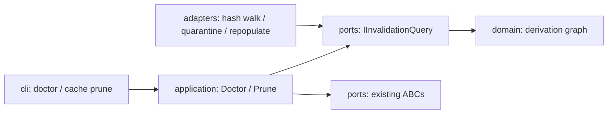

# Architecture Spine — Phase 3 State Awareness

## Design Paradigm

Hexagonal, synchronous, filesystem-authoritative — unchanged from Phase 2. Phase 3 adds query/repair/prune units inside the existing hexagon; no new processes, threads, or stores.

## Inherited Invariants

Parent `architecture-dotfiles-repo-v3-2026-08-18` AD-1..AD-20 are binding and read-only: inward dependencies, layered content-addressed cache, JSON store with FS authority, must-not-lose append-only history, runtime-owned `state_root`, symlink-only swap with symlinks leading, per-call env-overrides, SHA-256 versioned, staging-dir population, derivation graph, seed+R2 exception, sync imperative, nested-hexagon layout, domain purity, cross-package boundary, wallpaper hardlink, `current/` consumer wiring, backend abstraction, Typer CLI via `cli_output`, separate `dotfiles-runtime` binary.

## Invariants & Rules

### AD-21 — Invalidation is hash-compare only

- **Binds:** cache, derivation pipeline
- **Prevents:** re-derivation churn and key-scheme drift
- **Rule:** recompute spine input hashes (templates, catalog, mappings) with the Phase 2 canonicalization, compare against `meta.json`; regenerate the minimal stale set plus cascade (wallpaper→palette+effects, palette→icons). No new hash formulas, no layout change. [ADOPTED]

### AD-22 — Doctor owns three-way repair

- **Binds:** swap, persistence, cache health
- **Prevents:** split-brain between store, symlinks, and entries; destructive repair
- **Rule:** `DoctorUseCase` checks `current.json` vs `current/` targets vs `cache/<layer>/<hash>/` existence+health; repair quarantines bad entries by rename-aside (never `rm -rf`), repopulates via the Phase 2 pipeline, repoints stray symlinks to last-good state, then saves `current.json` and appends `history.jsonl` with `trigger: doctor`. Idempotent and re-runnable. [ADOPTED]

### AD-23 — Torn history tail policy

- **Binds:** history readers
- **Prevents:** one short write bricking every history consumer
- **Rule:** readers skip a non-JSON trailing line with a warning and report clean; only `doctor --repair` may truncate/quarantine it. Resolves the rt-3-1 deferred writer gap at the reader contract, not the writer. [ADOPTED] (Amended 2026-09-10, Story 2.3: read commands never mutate; the sole history writer `append_history` self-heals a torn tail before appending (a plain newline-prefix would convert a tolerable tail into loud middle corruption), and `doctor --repair` heals explicitly even when otherwise clean. A complete-but-unterminated JSON record is terminated, not truncated. Both paths share one locked adapter method. Writer atomicity/append-only guarantee preserved.)

### AD-24 — Eviction keeps active + recent + pinned

- **Binds:** cache lifecycle
- **Prevents:** unbounded growth and accidental deletion of live/seed state
- **Rule:** prune removes only entries unreferenced by `current.json`, outside last-N per layer (default 5), and not seed-pinned; explicit command, dry-run default-safe, every removal logged. [ADOPTED]

### AD-25 — New units land in existing layers

- **Binds:** repo structure, layering
- **Prevents:** second package style and core/adapter blur
- **Rule:** `IInvalidationQuery` in `ports/`; `DoctorUseCase`/`PruneUseCase` in `application/`; `doctor` + `cache prune [--verify]` in `cli/` composition root; all I/O stays in `adapters/`. `tests/architecture/test_layering.py` unchanged and green. [ADOPTED]

## Dependency Direction

## Deferred

- Auto-check on every `wallpaper set` (explicit in Phase 3; Phase 4 reconciler may fold it in).
- Keep-N tuning and seed-pin UX beyond defaults.
- Writer-side history atomicity redesign (multi-`write(2)` interleave stays accepted; reader tolerance is the Phase 3 contract).
- Daemon/watchers (Phase 5), declarative diff engine (Phase 4), parallel/plugins (Phase 6).
