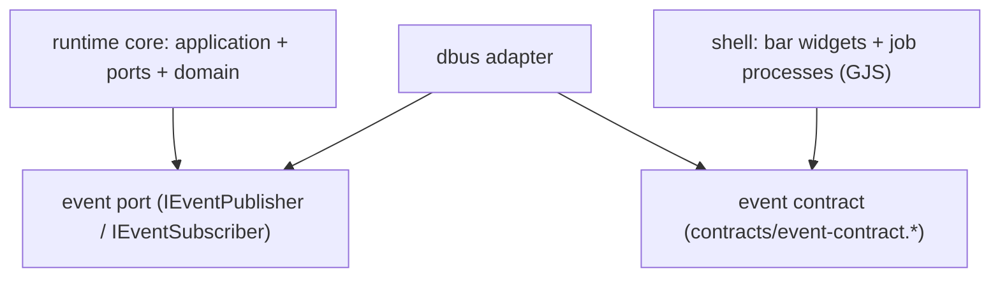
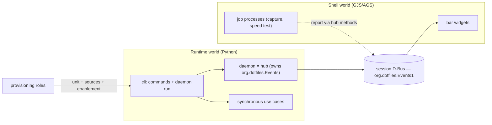

# Architecture Spine — Phase 5 Reactive Runtime

## Design Paradigm

Hexagonal (ports & adapters), inherited unchanged — with one addition: **the core stays synchronous and imperative; reactivity lives only at the edges.** Use cases are orchestrated function calls (Phase 2–4 model); tools, the daemon, and the bar exchange state through one machine-enforced event contract on the session D-Bus. No async/event bus is permitted inside the core.

## Inherited Invariants

| Inherited | From parent | Binds here |
| --- | --- | --- |
| AD-1/13/14/15/20/25 hexagon, layout, purity, boundaries, binary | Phase 2/3 spines | Where daemon, event ports, and adapters may live |
| AD-11 first-run seeding; runtime reads spine inputs READ-ONLY, never writes | Phase 2 spine | Watched roots are read-only; AD-39/AD-43 build on this |
| AD-12 synchronous imperative execution; "no daemon, async, event bus" | Phase 2 spine | **Narrowed by AD-35**: binds the core, not the edges |
| AD-4 append-only history; AD-23 torn-tail policy; AD-31 history lock | Phase 2/3/4 spines | Reactive writers join the same lock and append-only rules |
| AD-21/26/27 invalidation; AD-32 independent re-read | Phase 3/4 spines | The AD-36 backstop reuses these, never weakens them |
| AD-24/30 prune floor | Phase 3/4 spines | The daemon never deletes outside the protected floor |

## Invariants & Rules

### AD-33 — Daemon lifecycle and supervision

- **Binds:** the runtime daemon process and its provisioning
- **Prevents:** silent death, a Hyprland reload killing the loop, and a daemon that is "active" before it can serve
- **Rule:** the daemon runs as a `systemd --user` service with **`Type=dbus` + `BusName=org.dotfiles.Events`** (versionless name; the interface stays `org.dotfiles.Events1`), so systemd considers it started only when the name is owned. Unit: `Restart=always` (name loss is a clean stop, so `on-failure` is insufficient), `RestartSec` backoff, tuned `StartLimitIntervalSec`/`StartLimitBurst`, `Requires=dbus.socket` + `After=dbus.socket`, `WantedBy=graphical-session.target` + `After=graphical-session.target`. The daemon calls `RequestName(DO_NOT_QUEUE)`, fails fast non-zero on contention, **never exits 0 before owning the name**, and releases it on `SIGTERM`. Provisioning owns the unit (enabling via `graphical-session.target.wants/` when no live user manager). Daemon absent ⇒ reduced functionality; commands stay authoritative. [ADOPTED]

### AD-34 — Event contract and boundary

- **Binds:** every producer and consumer of runtime/shell events
- **Prevents:** the two worlds depending on each other's code; the core depending on D-Bus; divergent interface semantics
- **Rule:** one **shared, machine-enforced, versioned** contract on the session bus, pinned by `contracts/event-contract.md` + `contracts/event-contract.json` (names **and** schemas). The hub is **broker + job registry** and the sole emitter. Interface (`org.dotfiles.Events1`) methods: `Emit(topic,payload)`, `BeginJob(kind)→job_id`, `ReportProgress(job_id,fraction)`, `EndJob(job_id,exit_code)`, `GetActiveJobs`, `GetTopicState(topic)`. Signals: `JobStarted`/`JobProgress`/`JobFinished`, `DomainEvent`, `JobsCleared`. The hub allocates `job_id` and an **epoch**; on restart the epoch bumps and it emits `JobsCleared`. The runtime implements its side behind a port (`IEventPublisher`/`IEventSubscriber`) + D-Bus adapter; the core never imports D-Bus. The bar is a thin consumer. Version is in the interface name: an additive optional field, or a new method/signal/topic, is **not** breaking; a removed/retyped/newly-required field is `…Events2`, and `Events1`/`Events2` may coexist on the bus under distinct interface names during migration. `seq` is per-topic monotonic **within an `epoch`**; the epoch bumps on hub restart (resetting `seq`), and `GetTopicState` returns the current `_epoch` and `_seq`; consumers compare the `(epoch, seq)` pair. [ADOPTED]

### AD-35 — Orchestrate the core, choreograph the edges (AD-12 delta)

- **Binds:** the runtime execution model
- **Prevents:** rewriting the deterministic pipeline as an event mesh; reading AD-12 as forbidding the reactive layer entirely
- **Rule:** the pipeline stays synchronous and imperative; use cases stay pure and testable (AD-12 binds the core). Reactivity is added only at subsystem boundaries through AD-34. Automatic convergence is opt-in, ships observe-only first, and every automatic deletion stays within the AD-30 floor. Commands yield the same results with the daemon absent. The daemon **joins the existing `.seed.lock` / `.history.lock` per action**, never holding a lock across sleeps. [ADOPTED — narrows AD-12]

### AD-36 — Loop safety and recovery

- **Binds:** the daemon's trigger surface and its converge decision
- **Prevents:** reacting to the runtime's own writes; losing input changes that occur while the daemon is down
- **Rule:** the daemon reacts **only** to the watched root set (AD-39); that set is file-wise disjoint from everything the runtime writes. A **last-converged input-hash record**, persisted under `state_root` (an output location, never a watched root), is the backstop: on any event and **on start**, recompute input hashes; if unchanged, do nothing; else converge and persist. This makes the daemon idempotent and repairs downtime drift. An **unseeded** runtime (no `current.json`) is a benign no-op — never an error, never a restart; the daemon never seeds (AD-11). The runtime never writes a watched root. [ADOPTED]

### AD-37 — Tool classification

- **Binds:** every tool/app/CLI
- **Prevents:** each tool independently deciding whether it is a daemon, wrapper, or command
- **Rule:** classify by lifetime and who knows the state:
  - **Batch commands** (run, produce, exit — CSG, WEG, ITR) stay CLIs; never daemonized.
  - **Lifetime jobs** (capture recorder, speed test) own the observed process (ownership is **transitive**: if a wrapper spawns it and would exit, ownership is handed to the hub) and **report via hub methods** (`BeginJob`/`ReportProgress`/`EndJob`) — the **hub** emits the lifecycle signals.
  - **Interactive apps with domain meaning** (ICME) publish their own domain event at the meaningful moment (on save, not exit).
  - **Existing D-Bus services** (NetworkManager) are bound directly, never wrapped.
  Lifecycle and domain events are distinct; a UI indicator for a tool is driven by that tool's **domain events only**, never `JobStarted`/`JobFinished`. [ADOPTED]

### AD-38 — Hub ownership and trust boundary

- **Binds:** the event hub and every producer
- **Prevents:** multiple owners of the well-known name; a shadow hub hiding signals; over-claiming authorization the bus cannot enforce
- **Rule:** exactly one process — the runtime daemon — owns `org.dotfiles.Events` and is the signal hub; jobs/tools emit **through** it and never `RequestName` an `org.dotfiles.*` name (if the daemon is absent they publish nothing). The session bus is a **trusted same-user domain** (the attacker is the user; there is no privilege boundary). The hub enforces **structural validation** — schema, size, and depth caps, and rate — on every `Emit`, **not** per-sender identity. Threat model is documented; damage stays bounded by the AD-30 floor and observe-only-first. A unix socket with `SO_PEERCRED` is the future path only if multi-user/untrusted publishers arrive. [ADOPTED]

### AD-39 — Watched root set (enumerated allowlist)

- **Binds:** the daemon's watch configuration and the intent-document location
- **Prevents:** a coarser/dynamic root set re-introducing a loop or a repo coupling
- **Rule:** the watched roots are an **explicit enumerated allowlist of SPINE locations** (never the result of `derive.find_*`, which may return a repo path): `<install>/config/color-scheme-generator/templates`, `<install>/config/weg/effects.yaml`, `<install>/icon-templates`, `<install>/icon-mappings`, plus the intent document at `$XDG_CONFIG_HOME/dotfiles/desired.json`. It **excludes** the consumer-pointer destinations (`<install>/config/ags/colors.css`, `<install>/config/gtk-*/colors.css`, `<install>/config/rofi/colors.rasi`) and all of `state_root`. **No watches above a root's immediate parent**; a file root is watched via its immediate parent filtered to the exact filename (atomic-replace safe); nested directory roots are watched recursively over their **whole bounded tree** (`icon-templates` up to 4 levels, csg templates up to 2) with a directory watch per level, and a directory watch persists across atomic replaces of files inside it. Wallpaper content is presented via the `wallpaper set` action, not watched. If the AD-36 backstop is persisted it lives under `state_root`. [ADOPTED]

### AD-40 — Watch strategy

- **Binds:** the daemon's file-event handling
- **Prevents:** event storms, lost events on queue overflow, and any polling
- **Rule:** inotify over the AD-39 roots only; **coalesce/debounce** bursts into a single reconcile; on **`IN_Q_OVERFLOW`** perform a full recursive re-scan of the affected root; a directory watch persists across in-directory atomic replaces (a file-root watch via the immediate parent outlives the replace, so no re-establishment is needed). **No polling** (state is event-sourced; timers render only continuous values). Because inotify is non-recursive, the tree watches are installed explicitly per level to the bounded depth. [ADOPTED]

### AD-41 — Observability and safety

- **Binds:** the daemon and every automatic action
- **Prevents:** invisible automatic mutation, unrecoverable surprise deletion, and undetected store/history divergence
- **Rule:** automatic convergence ships **observe-only first**; status is `systemctl --user` plus a read-only inspect surface; a kill switch stops the unit; every automatic action (regenerate/prune) is logged with its trigger; the prune delete-audit line is retained; `doctor` detects and repairs `current.json`↔history divergence. The daemon assumes its own last write may have failed and re-checks rather than trusting it. [ADOPTED]

### AD-42 — History trigger enum

- **Binds:** history writers and the inspect validator
- **Prevents:** a daemon/prune success path failing validation on an unknown trigger
- **Rule:** the trigger enum is **single-sourced** as `seed | set | reconcile | regenerate | doctor | prune | reactive`. A real prune execution appends exactly one history line `trigger="prune"` with counts (dry-run appends nothing); a daemon-initiated converge appends `trigger="reactive"`. Any new value ships in the same change as the shared-data-contract and the inspect validator. No unit may accept a trigger value absent from the definition (AD-44). [ADOPTED]

### AD-43 — Derivation inputs resolve from the spine only

- **Binds:** `derive.find_*` and provisioning completeness
- **Prevents:** a missing spine input being silently satisfied from the repo (masking a provisioning gap)
- **Rule:** in production the runtime resolves derivation inputs from the **install spine only**. The repo-ancestor fallback becomes an **explicit opt-in dev override** (env-gated); a missing input is a **loud typed failure**, never a silent repo read. Provisioning `verify` asserts input **content**, not just containers (`icon-mappings/icons.yaml` + siblings, non-empty `icon-templates` and `config/color-scheme-generator/templates`, plus `config/weg/effects.yaml`). A runtime provenance check surfaces any repo-sourced input. [ADOPTED]

### AD-44 — Shared contracts are machine-enforced

- **Binds:** every cross-boundary shared contract (history trigger enum, `current.json`, `meta.json`, the event contract)
- **Prevents:** prose contracts drifting silently from the code (e.g. the doc that said four trigger values while the code enforced six)
- **Rule:** each shared contract has **exactly one machine-checkable definition** (code constants / JSON schema). Prose documents are **descriptive**, never authoritative; where practical their tables are generated from the definition. A **drift test** fails when a document and its definition disagree. [ADOPTED]

## Consistency Conventions

| Concern | Convention |
| --- | --- |
| D-Bus naming | bus name `org.dotfiles.Events` (versionless); interface `org.dotfiles.Events1`; version is a trailing integer on the interface only |
| State vs polling | state transitions are event-sourced; **nothing polls state**. Continuous display (elapsed, animation) derives from a monotonic clock plus one recorded start, never from re-reading a state file |
| Tool state files | a tool's state file is a **write-behind projection** of its event stream, never the authority for a live consumer; on divergence the event stream wins and doctor repairs the file |
| Delivery & hydration | signals are at-most-once; a consumer hydrates via `GetTopicState`/`GetActiveJobs` with **subscribe-before-read** and a per-topic monotonic `seq`; missed events are recovered by hydration, never by polling |
| Payload limits | the hub validates schema/size/depth and rate; payloads are bounded, JSON-compatible D-Bus scalars and containers, no opaque binary (type signatures live in `contracts/event-contract.md`) |
| Contract enforcement | one machine-checkable definition per contract; prose descriptive; drift test per language (AD-44) |
| Execution model | core synchronous; edges choreographed through the contract; commands authoritative and daemon-optional |
| Locks | the daemon joins `.seed.lock` / `.history.lock` per action, never across sleeps |
| Automatic actions | opt-in, observe-only first, logged with trigger; deletions bounded by the AD-30 floor |
| Absence & recovery | every participant tolerates the others' absence (no consumer ⇒ no-op; no daemon ⇒ reduced functionality); converge-on-start repairs downtime drift; never crash-loop |
| Session scope | one active graphical session per user is assumed; `state_root` is per-user (multi-session scoping deferred) |

## Stack

| Name | Version |
| --- | --- |
| Hexagonal Python runtime (`dotfiles-runtime`) | inherited, unchanged |
| Session D-Bus (per-user IPC) | system-provided |
| Bar/GJS D-Bus client | Gio (system GLib via GObject Introspection) |
| Python D-Bus client (runtime adapter) | deferred (implementation) |
| File-event source (inotify) | deferred (implementation) |
| systemd `--user` | system-provided (uwsm-managed session) |

## Structural Seed



The core depends on the port, never on the transport; both worlds depend on the contract, never on each other.



```text
src/runtime/
  src/runtime/ports/event_bus.py         # IEventPublisher / IEventSubscriber (pure)
  src/runtime/adapters/dbus_event_bus.py # session-D-Bus implementation of the port
  src/runtime/src/runtime/daemon/        # the foreground loop hosted by `daemon run`
dotfiles/config/ags/                     # bar consumers (bind to the contract)
contracts/event-contract.md|json         # the shared, machine-enforced contract
```

## Deferred

- Concrete Python D-Bus client library and inotify library; the sync-core constraint is binding (prefer a GLib/sync client over an asyncio-first one) and inotify is non-recursive.
- User-systemd-unit provisioning enablement when no live user manager exists (symlink into `graphical-session.target.wants/`); no role writes `~/.config/systemd/user/` today.
- `WatchdogSec` + `sd_notify` for a wedged-but-name-owning daemon.
- Multi-session/seat scoping of `state_root`.
- Pinned-entry lifecycle (`pins_to_add` persistence) — carried from Phase 4.
- Whether ICME-style authoring events also notify the bar beyond triggering regeneration.
- Parallel execution, plugin interfaces, incremental dependency graph, distributed cache (Phase 6).
