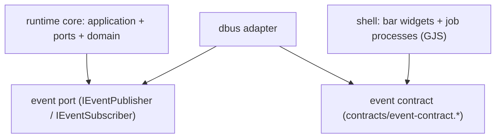
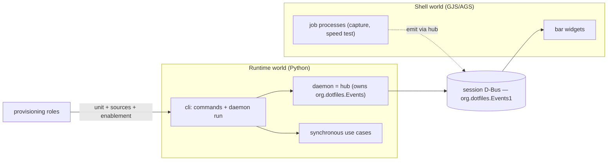

# Architecture Spine — Phase 5 Reactive Runtime

## Design Paradigm

Hexagonal (ports & adapters), inherited unchanged — with one addition: **the core stays synchronous and imperative; reactivity lives only at the edges.** The runtime's use cases are orchestrated function calls (Phase 2–4 model); tools, the daemon, and the bar exchange state through one event contract on the session D-Bus. No async/event bus is permitted inside the core.

## Inherited Invariants

| Inherited | From parent | Binds here |
| --- | --- | --- |
| AD-1/13/14/15/20/25 hexagon, layout, purity, boundaries, binary | Phase 2/3 spines | Where daemon, event ports, and adapters may live |
| AD-11 first-run seeding; runtime reads spine inputs READ-ONLY, never writes | Phase 2 spine | Watched roots are read-only; AD-36/AD-39 build on this |
| AD-12 synchronous imperative execution; "no daemon, async, event bus" | Phase 2 spine | **Narrowed by AD-35**: binds the core, not the edges |
| AD-4 append-only history; AD-23 torn-tail policy; AD-31 history lock | Phase 2/3/4 spines | Reactive writers join the same lock and append-only rules |
| AD-21/26/27 invalidation; AD-32 independent re-read | Phase 3/4 spines | The AD-36 backstop reuses these, never weakens them |
| AD-24/30 prune floor | Phase 3/4 spines | The daemon never deletes outside the protected floor |
| AD-19 operational envelope | Phase 2 spine | Daemon/watcher presence, absence, and recovery behavior |

## Invariants & Rules

### AD-33 — Daemon lifecycle and supervision

- **Binds:** the runtime daemon process and its provisioning
- **Prevents:** a silently dead watcher, and a Hyprland reload killing the reactive loop
- **Rule:** the reactive runtime runs as a **systemd `--user` service** (`Type=simple`, `Restart=on-failure`); lifecycle control is `systemctl --user` — no pidfile, no `daemon start/stop` subcommand. **Provisioning owns the configuration** (unit file and enablement); the runtime provides exactly one foreground command, `dotfiles-runtime daemon run`, as `ExecStart`. The daemon must be optional: commands remain authoritative and work with it absent. [ADOPTED]

### AD-34 — Event contract and boundary

- **Binds:** every producer and consumer of runtime/shell events
- **Prevents:** the two worlds depending on each other's code; the core depending on D-Bus
- **Rule:** one **shared, language-neutral, versioned** contract on the **session bus** is the only thing the two worlds share. It is pinned by `contracts/event-contract.md` and `contracts/event-contract.json` — **the JSON carries both names and payload schemas** and is the test-time source of truth. The runtime implements its side behind a **port** (`IEventPublisher`/`IEventSubscriber`) with a D-Bus **adapter**; the core never imports D-Bus. The bar is a thin consumer binding the same names. Version is in the interface name (`…Events1`); a breaking shape change is `…Events2`. [ADOPTED]

### AD-35 — Orchestrate the core, choreograph the edges (AD-12 delta)

- **Binds:** the runtime execution model
- **Prevents:** rewriting the deterministic pipeline as an event mesh; reading AD-12 as forbidding the reactive layer entirely
- **Rule:** the Phase 2–4 pipeline stays **synchronous and imperative**; use cases remain pure and unit-testable (AD-12 binds the core, unchanged). Reactivity is added **only at subsystem boundaries** through AD-34's contract. Automatic convergence is **opt-in**, ships **observe-only first**, and every automatic deletion stays within the AD-30 protected floor. Commands yield the same results with the daemon absent. [ADOPTED — narrows AD-12]

### AD-36 — Loop safety

- **Binds:** the daemon's trigger surface
- **Prevents:** reacting to the runtime's own writes (feedback loop)
- **Rule:** (A) the daemon reacts **only** to the **watched root set** defined by AD-39; that set is file-wise **disjoint** from everything the runtime writes — `state_root` is pure output, and intent moves out of it (AD-39). (B) A **last-converged input-hash backstop**, held in memory: on any event, recompute the input hashes; if unchanged, do nothing. The runtime never writes a watched root (AD-11 restated). [ADOPTED]

### AD-37 — Tool classification

- **Binds:** every tool/app/CLI
- **Prevents:** each tool independently deciding whether it is a daemon, wrapper, or command
- **Rule:** classify by lifetime and who knows the state:
  - **Batch commands** (run, produce, exit — CSG, WEG, ITR) stay CLIs; never daemonized.
  - **Lifetime jobs** (capture recorder, speed test) publish lifecycle + domain events. A lifetime job is the **long-lived, D-Bus-capable owner** that outlives and holds the observed child; a wrapper must **never exit while a child it spawned still lives** — if residency is impossible, it **hands ownership to the daemon (hub)**.
  - **Interactive apps with domain meaning** (ICME) publish their **own domain event at the meaningful moment** (on save, not exit).
  - **Existing D-Bus services** (NetworkManager) are bound directly, never wrapped.
  Lifecycle and domain events are distinct: a supervisor infers lifecycle; only the tool emits domain events. The capture indicator is driven by **domain events only**, never `JobStarted`/`JobFinished`. [ADOPTED]

### AD-38 — One bus-name owner and trust boundary

- **Binds:** every event producer
- **Prevents:** multiple owners of one well-known name, and a shadow hub hiding signals from consumers
- **Rule:** exactly one process — the runtime daemon (`dotfiles-runtime daemon run`) — owns the well-known name `org.dotfiles.Events` and is the **signal hub**. Jobs and tools emit through the hub's interface and never `RequestName` an `org.dotfiles.*` name; if the daemon is absent they publish nothing (consumers show no state, never a shadow hub). The contract is **session-bus only**. The hub pins a **caller→topic authorization** mapping (allowed sender identity per topic) and rejects a non-conforming `Emit`; `producer` is validated by the hub, never self-asserted. **No automatic deletion may be triggered by an untrusted publisher.** [ADOPTED]

### AD-39 — Watched root set (enumerated allowlist)

- **Binds:** the daemon's watch configuration and the intent-document location
- **Prevents:** a coarser root set (e.g. a parent dir) re-introducing a loop by overlapping runtime outputs
- **Rule:** the watched roots are an **explicit enumerated allowlist**: the four derivation inputs resolved by `derive.find_*` (CSG templates dir, WEG effects catalog, icon-templates dir, icon-mappings file) plus the **relocated intent document at `$XDG_CONFIG_HOME/dotfiles/desired.json`**. It **excludes** the consumer-pointer destinations (`<install>/config/ags/colors.css`, `<install>/config/gtk-*/colors.css`, `<install>/config/rofi/colors.rasi`) and all of `state_root`. **No watches above a root's immediate parent**: a directory root is watched directly; a file root is watched via its **immediate parent directory filtered to the exact filename** (atomic-replace safe) — never a recursive/ancestor watch of `<install>/config`. If the AD-36 backstop is ever persisted, it lives under `state_root`, never a watched root. [ADOPTED]

### AD-40 — Watch strategy

- **Binds:** the daemon's file-event handling
- **Prevents:** event storms, lost events on queue overflow, and any polling
- **Rule:** watch only the AD-39 roots; **coalesce/debounce** bursts into a single reconcile; on **`IN_Q_OVERFLOW`** perform a full re-scan of the roots. **No polling fallback** (state is event-sourced; timers render only continuous values). inotify is not recursive, so each root directory is watched explicitly. [ADOPTED]

### AD-41 — Observability and safety

- **Binds:** the daemon and every automatic action
- **Prevents:** invisible automatic mutation and unrecoverable surprise deletion
- **Rule:** automatic convergence ships **observe-only first**; status is `systemctl --user` plus a read-only inspect surface; a **kill switch** stops the unit; every automatic action (regenerate/prune) is **logged with its trigger**; delete-audit is retained. [ADOPTED]

### AD-42 — Reactive history trigger

- **Binds:** history writers and the inspect validator
- **Prevents:** a daemon success path failing history validation on an unknown trigger value
- **Rule:** a daemon-initiated converge appends history with the new `reactive` trigger. Adding the value ships **in the same change** as the shared-data-contract enum update and the inspect validator update. No unit may introduce or accept a history trigger value absent from the contract. [ADOPTED]

## Consistency Conventions

| Concern | Convention |
| --- | --- |
| D-Bus naming | well-known names under `org.dotfiles.*`; version is a trailing integer; base members pinned in `event-contract.json` |
| State vs polling | state transitions are event-sourced; **nothing polls state**. Continuous display (elapsed time, animation) derives from a monotonic clock plus one recorded start, never from re-reading a state file on a timer |
| Tool state files | a tool's own state file is a **write-behind projection** of its event stream, never the authority for a live consumer; on divergence the event stream wins and doctor repairs the file |
| Contract enforcement | `event-contract.json` holds names **and payload schemas**; each language bakes constants and a drift test asserts both. **No codegen** |
| Execution model | core synchronous; edges choreographed through the contract; commands authoritative and daemon-optional |
| Automatic actions | opt-in, observe-only first, logged with trigger; deletions bounded by the AD-30 floor |
| Absence & recovery | every participant tolerates the others' absence (no consumer ⇒ no-op; no daemon ⇒ no auto mode); no participant crash-loops |
| Errors | typed, surfaced; a reactive trigger failure is logged and retried with backoff |

## Stack

| Name | Version |
| --- | --- |
| Hexagonal Python runtime (`dotfiles-runtime`) | inherited, unchanged |
| Session D-Bus (per-user IPC) | system-provided |
| Bar/GJS D-Bus client | Gio (system GLib via GObject Introspection) |
| Python D-Bus client (runtime adapter) | deferred (implementation) |
| File-event source (inotify) | deferred (implementation) |
| systemd `--user` | system-provided (uwsm-managed session) |

## Structural Seed



The core depends on the port, never on the transport; both worlds depend on the contract, never on each other.



```text
src/runtime/
  src/runtime/ports/event_bus.py         # IEventPublisher / IEventSubscriber (pure)
  src/runtime/adapters/dbus_event_bus.py # session-D-Bus implementation of the port
  src/runtime/src/runtime/daemon/        # the foreground loop hosted by `daemon run`
dotfiles/config/ags/                     # bar consumers (bind to the contract)
contracts/event-contract.md|json         # the shared contract (companion)
```

## Deferred

- Concrete Python D-Bus client library and inotify library; the sync-core constraint is binding (prefer a GLib/sync client over an asyncio-first one), and inotify is non-recursive.
- User-systemd-unit provisioning mechanics: no existing role writes `~/.config/systemd/user/`; enablement must work whether or not bootstrap runs inside a user D-Bus session.
- Pinned-entry lifecycle (whether `pins_to_add` ever persists) — carried from Phase 4.
- Whether ICME-style authoring events also notify the bar beyond triggering regeneration — revisit only if a real need appears.
- Parallel execution, plugin interfaces, incremental dependency graph, distributed cache (Phase 6).
