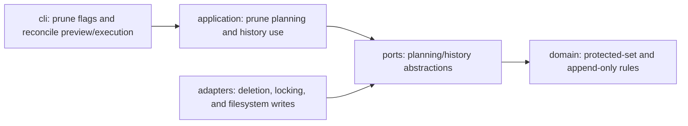

# Architecture Spine — Phase 4 Reconciliation-Engine Decision Handoff

## Design Paradigm

Hexagonal, synchronous, filesystem-authoritative — inherited unchanged. These
two decisions add controlled deletion and serialized history writes without
introducing a daemon, async orchestration, event bus, distributed execution,
or a new store.

## Inherited Invariants

| Inherited | From parent | Binds here |
| --- | --- | --- |
| AD-24 eviction policy, as extended by AD-30 for undated entries | `architecture-dotfiles-repo-v3-2026-09-07` | Auto/manual deletion, last-N, seed-pinned entries, dry-run/logged behavior |
| AD-4 append-only history | `architecture-dotfiles-repo-v3-2026-08-18` | Writer locking must preserve append-only must-not-lose history |
| AD-12 synchronous imperative execution | `architecture-dotfiles-repo-v3-2026-08-18` | Preview/execute and repair flows remain synchronous |
| AD-1/AD-13/AD-14/AD-15/AD-20 hexagon, layout, purity, boundaries, binary | `architecture-dotfiles-repo-v3-2026-08-18` | Placement of prune/history behavior in domain, ports, adapters, application, and CLI |

## Invariants & Rules

### AD-30 — Hybrid automatic and manual prune policy

- **Binds:** Phase 4 planner delete steps and the explicit `prune` command
- **Prevents:** surprise deletion by automation while preserving deliberate manual cleanup
- **Rule:** prune policy resolves as code default `keep=5` < desired-state declaration < explicit CLI flags. Automatic prune may delete only candidates outside the protected floor: active entries, last-N per layer, seed-pinned entries, and undated entries. Manual `prune` may override policy aggressively via `--keep 0` and `--prune-pinned`, but active + undated entries survive every flag combination (whole-cache deletion is not offered). Every real prune execution appends exactly one `history.jsonl` line with `trigger="prune"` and counts; dry-run appends nothing. Automatic execution uses `reconcile --plan` preview followed by logged `reconcile` execution; no interactive prompt. [ADOPTED]

### AD-31 — Serialized history.jsonl writers

- **Binds:** every `history.jsonl` writer
- **Prevents:** torn-line interleaving from concurrent writers
- **Rule:** all history writers serialize through one OS-level file lock, scoped to local POSIX; lock-acquire/hold/release failures surface as typed errors. Append-only behavior is unchanged. [ADOPTED]

### AD-32 — Invalidation checks independently re-read (accepted re-read cost)

- **Binds:** `CheckInputsUseCase` / `IInvalidationQuery` and any future "did inputs change?" check, including the `wallpaper set` auto-check (Story 4.7)
- **Prevents:** two failure modes — (a) a "check" that shares the value it is checking and therefore always reports fresh; (b) treating the resulting duplicated hash walk as a defect and "optimizing" it away by threading computed hashes into the check
- **Rule:** an invalidation check MUST recompute input hashes from the source and compare against recorded `meta.json`. It MUST NOT accept a caller-supplied hash that was computed by the same invocation that produced or refreshed the entry. Consequence: the spine input hash walk (`canonical_hash_dir` on templates, `hash_file` on the effects catalog, icon templates/mappings) runs once during derivation and once during the check. This duplication is an accepted cost of the correctness invariant, not debt. Legitimate relief, if ever measured material, is at the primitive (an mtime/size-keyed memo inside `adapters/hashing.py`) or at the feature's placement (run the check where inputs could actually have drifted, not immediately after the derivation that just read them) — never at the trust boundary. [ADOPTED]

**Rationale (Phase 4 close, 2026-09-11):** the code-review panel flagged the auto-check's second hash walk as "redundant work". It is redundant work and it is correct: AD-21 pins invalidation as an independent hash-compare, and apply's already-computed hash cannot be reused without collapsing the check into a tautology. Separately, the auto-check placed immediately after a successful `wallpaper set` is near-tautological by construction (apply just derived from those inputs), so its only real value is detecting a concurrent edit in the window between the two reads — a placement/scope question to revisit if it proves low-value, not an implementation flaw.

## Dependency Direction

## Deferred

- Remaining Phase 4 scope: `desired state` shape, `actual state` projection, diff semantics, execution-plan ordering, and failure policy.
- Daemon/watchers (Phase 5), parallel execution/plugins, incremental dependency graph, and distributed cache.
- Favorites-style pinned data may later join the protected floor as desired-state data; no rule change is approved here.
