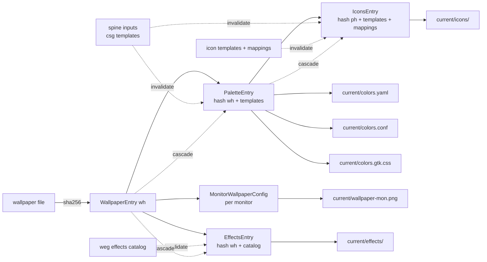
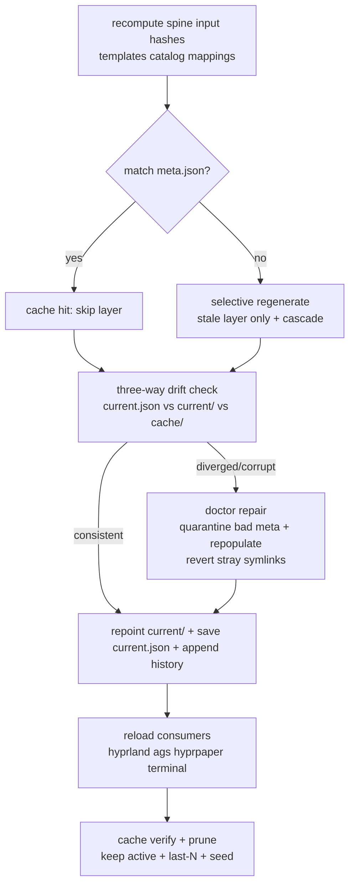
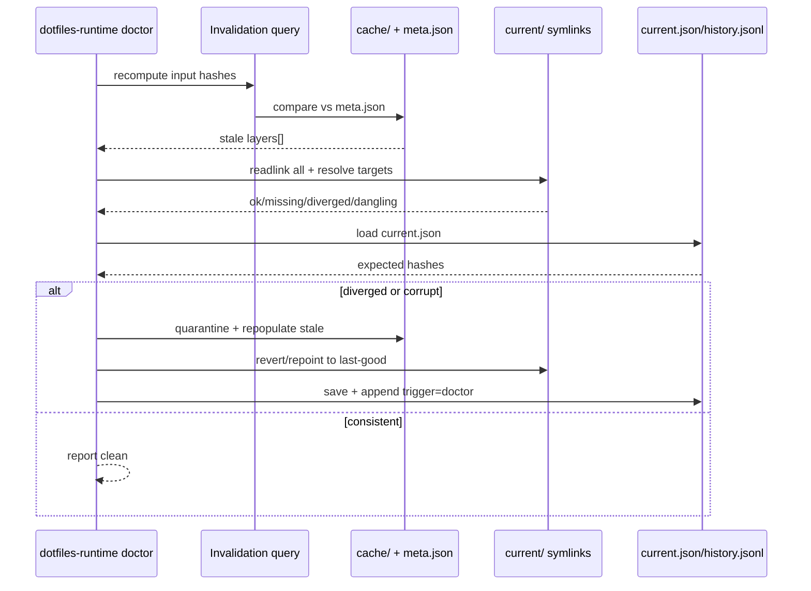

# Phase 3 — State Awareness: Diagrams (MG)

Source: as-built Phase 2 runtime (`src/runtime/`, `ARCHITECTURE-SPINE.md` AD-1..AD-20, `cache-model.md`, `consumer-wiring.md`, Epic 4 single-source).
Target: Phase 3 invalidation + drift-heal + eviction. Synchronous, hexagonal, FS-authoritative. No daemon (Phase 5).

## 1. Derivation graph + invalidation edges (extends spine)

## 2. Phase 3 pipeline: check → invalidate → regenerate → heal → prune

## 3. Drift-decision sequence (doctor)

