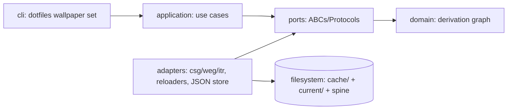
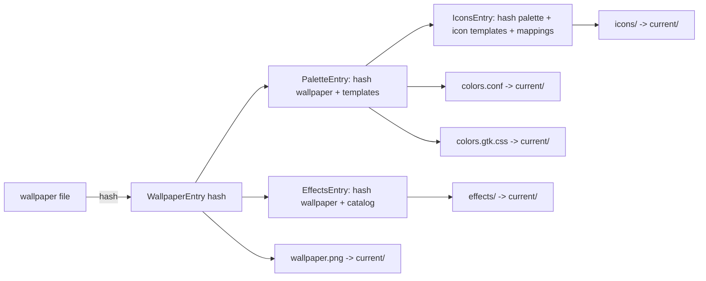
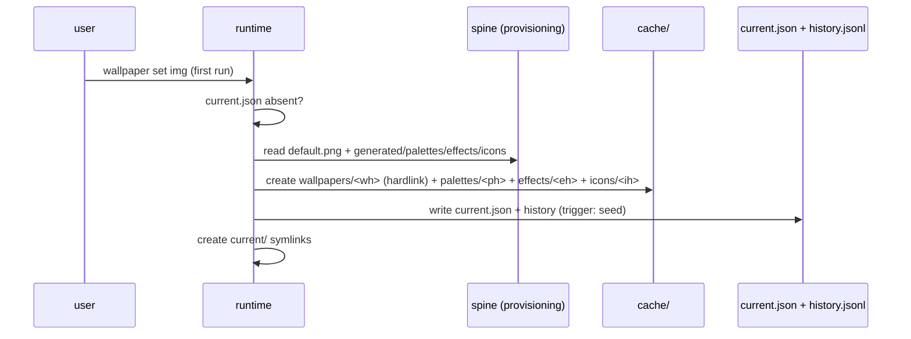
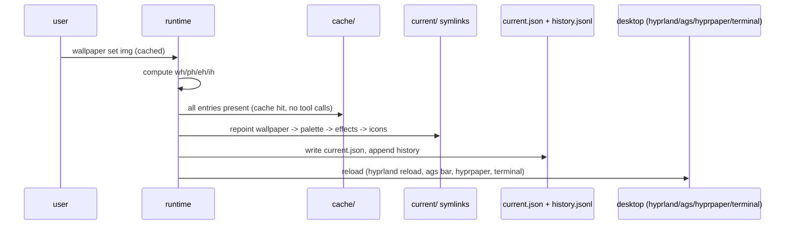

# Architecture Diagrams — dotfiles-runtime-phase2

Companion to SPEC-dotfiles-runtime-phase2. Diagrams for the runtime core. Mermaid blocks live here (never in the kernel).

## Dependency direction (hexagonal)

## Derivation graph

## First-run seeding sequence

## Cache-hit swap sequence

