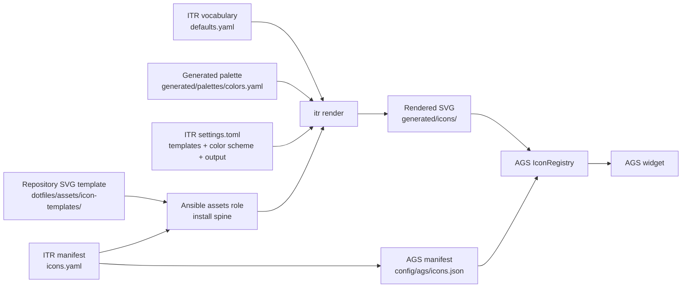

# Adding an Icon: ITR and Provisioning Pipeline

This guide explains what “adding an icon” means in this repository.

An icon is not complete when an SVG has been copied into a directory. A
working icon must pass through the asset, color, rendering, provisioning, and
consumer layers so that:

- the source remains version-controlled and reproducible;
- the icon follows the active generated palette;
- a fresh machine receives the same files as the development host;
- AGS can resolve the rendered output without hardcoded ad-hoc paths; and
- the widget displays the icon at the intended size and state.

The recorder pause, play, and stop controls are the reference example used
throughout this document.

## 1. Pipeline overview

The complete flow is:



In a normal bootstrap:

1. The `assets` role deploys icon templates and icon mappings into the install
   spine.
2. The palette workflow creates `generated/palettes/colors.yaml`.
3. The settings workflow creates the ITR `settings.toml`.
4. The `icons` role invokes `itr render`.
5. ITR reads the deployed mappings, templates, vocabulary, and palette.
6. ITR writes rendered SVGs to `generated/icons/`.
7. The compositor configuration role deploys AGS source files, including
   `icons.json` and `icon-registry.ts`.
8. AGS resolves the generated file and loads it in the widget.

The repository is the authority. The host install spine is a generated
deployment target, not a second place to edit icons.

## 2. Repository locations

| Layer | Repository path | Provisioned location |
|---|---|---|
| SVG templates | `dotfiles/assets/icon-templates/` | `~/.local/share/dotfiles/icon-templates/` |
| ITR mappings | `dotfiles/config/icon-template-color-scheme-mappings/` | `~/.local/share/dotfiles/icon-mappings/` |
| ITR vocabulary | `dotfiles/config/icon-template-color-scheme-mappings/defaults.yaml` | Alongside the deployed mappings |
| ITR settings | Generated by the `settings` role | `~/.local/share/dotfiles/config/itr/settings.toml` |
| Generated palette | Generated by the palette workflow | `~/.local/share/dotfiles/generated/palettes/colors.yaml` |
| Rendered icons | ITR output | `~/.local/share/dotfiles/generated/icons/` |
| AGS manifest | `dotfiles/config/ags/icons.json` | `~/.local/share/dotfiles/config/ags/icons.json` |
| AGS resolver | `dotfiles/config/ags/lib/icon-registry.ts` | `~/.local/share/dotfiles/config/ags/lib/icon-registry.ts` |
| AGS widgets | `dotfiles/config/ags/bar/widgets/` | `~/.local/share/dotfiles/config/ags/bar/widgets/` |

The user-facing XDG paths may be symlinked into the install spine. Always
inspect the resolved path with `readlink -f` when debugging which file AGS is
actually using.

## 3. Step 1: create the SVG template

Create a group directory under the existing icon-template asset tree:

```text
dotfiles/assets/icon-templates/<group>/<variant-or-style>/icon.svg
```

For the recorder:

```text
dotfiles/assets/icon-templates/screen-recorder/default/pause.svg
dotfiles/assets/icon-templates/screen-recorder/default/play.svg
dotfiles/assets/icon-templates/screen-recorder/default/stop.svg
```

### 3.1 Use palette placeholders, not fixed colors

An SVG that contains this is not palette-aware:

```xml
<path d="..." fill="black"/>
```

Use the ITR placeholder vocabulary instead:

```xml
<path d="..." fill="{{COLOR_FOREGROUND}}"/>
```

The standard vocabulary is defined in:

```text
dotfiles/config/icon-template-color-scheme-mappings/defaults.yaml
```

The current defaults are:

```yaml
defaults:
  COLOR_FOREGROUND: foreground
  COLOR_BACKGROUND: surface
  COLOR_SECONDARY: accent
  COLOR_ACCENT: accent-muted
```

The left side is the placeholder used in SVG files. The right side is the
key looked up in the generated color scheme.

Do not assume that a literal `black` will be recolored later. ITR only
substitutes recognized `{{PLACEHOLDER}}` values. Literal SVG colors remain
literal colors.

### 3.2 Use the source SVG's viewBox deliberately

The `viewBox` controls the coordinate system and therefore affects how the
icon scales. Preserve a valid `viewBox` from the source asset. Do not
silently crop or rewrite it while integrating the icon.

Before debugging CSS, inspect the SVG itself:

```bash
head -5 dotfiles/assets/icon-templates/screen-recorder/default/play.svg
```

Check that:

- the file is valid XML/SVG;
- it has a `viewBox`;
- visible paths are inside that viewBox; and
- fills and strokes use placeholders where palette control is intended.

## 4. Step 2: register the group in `icons.yaml`

Add the group to:

```text
dotfiles/config/icon-template-color-scheme-mappings/icons.yaml
```

Basic shape:

```yaml
screen-recorder:
  color_mappings:
    COLOR_FOREGROUND: foreground
  variants:
    - name: pause
      template: screen-recorder/default/pause.svg
      output: screen-recorder-pause.svg
    - name: play
      template: screen-recorder/default/play.svg
      output: screen-recorder-play.svg
    - name: stop
      template: screen-recorder/default/stop.svg
      output: screen-recorder-stop.svg
```

Each field has a specific role:

| Field | Meaning |
|---|---|
| Group key | Namespace used by ITR and the AGS registry |
| `color_mappings` | Maps SVG placeholders to palette keys or literal colors |
| `variants[].name` | Logical name used by callers |
| `variants[].template` | Path relative to the icon-template root |
| `variants[].output` | Filename written under `generated/icons/` |

### 4.1 Color mapping precedence

ITR merges color mappings in this order, from lowest to highest priority:

1. vocabulary defaults from `defaults.yaml`;
2. group-level `color_mappings`;
3. variant-level `color_mappings`.

For a standard foreground icon, the vocabulary default may be enough.
Declaring it at group level, as the recorder group does, makes the group's
color contract visible and protects it if the default vocabulary changes.

Use a palette key such as `foreground` when the icon should follow the
generated theme:

```yaml
color_mappings:
  COLOR_FOREGROUND: foreground
```

Use a literal hex value only when the icon intentionally has a fixed color:

```yaml
color_mappings:
  COLOR_ACCENT: "#ff0000"
```

Fixed colors should be the exception. They bypass palette adaptation.

## 5. Step 3: generate the AGS manifest during provisioning

AGS consumes a generated JSON representation of the same manifest:

```text
~/.local/share/dotfiles/config/ags/icons.json
```

The authored source is:

```text
dotfiles/config/icon-template-color-scheme-mappings/icons.yaml
```

During provisioning, the compositor configuration role reads the deployed
`icon-mappings/icons.yaml` and writes `config/ags/icons.json` automatically.
Therefore, new groups and variants should be added only to `icons.yaml`; the
JSON file in the install spine is generated output and must not be edited by
hand.

Equivalent JSON entry:

```json
"screen-recorder": {
  "color_mappings": {
    "COLOR_FOREGROUND": "foreground"
  },
  "variants": [
    {
      "name": "pause",
      "template": "screen-recorder/default/pause.svg",
      "output": "screen-recorder-pause.svg"
    },
    {
      "name": "play",
      "template": "screen-recorder/default/play.svg",
      "output": "screen-recorder-play.svg"
    },
    {
      "name": "stop",
      "template": "screen-recorder/default/stop.svg",
      "output": "screen-recorder-stop.svg"
    }
  ]
}
```

The generated `template`, `output`, and `color_mappings` values come directly
from `icons.yaml`. `bar_mappings` is preserved as well because it contains the
AGS state-to-variant mapping.

Validate JSON before provisioning:

```bash
python -m json.tool ~/.local/share/dotfiles/config/ags/icons.json >/dev/null
```

## 6. Step 4: understand `IconRegistry`

The shared resolver is:

```text
dotfiles/config/ags/lib/icon-registry.ts
```

Callers should use the registry instead of constructing generated-icon paths
themselves:

```ts
const path = registry.resolve("screen-recorder", "pause")
```

Resolution works as follows:

1. Look up the group in `icons.json`.
2. Find the variant by its logical `name`.
3. Build the runtime-current path:
   `~/.local/state/dotfiles/current/icons/<output>`.
4. Use it if it exists.
5. Otherwise check:
   `~/.local/share/dotfiles/generated/icons/<output>`.
6. Return `null` if neither file exists.

The runtime-current directory takes precedence because it can represent
runtime-managed or atomically repointed assets. The generated directory is
the provisioned fallback.

Use the registry for all AGS icon consumers, including bar widgets, capture
controls, power-menu controls, and future widgets.

## 7. Step 5: load the icon in AGS

A static icon can be assigned when the widget is created:

```tsx
<image
  pixel_size={16}
  class="widget-icon"
  $={(self) => self.set_from_file(registry.resolve("group", "variant") ?? "")}
/>
```

For a stateful icon, use an explicit reactive effect and perform an initial
assignment inside that effect:

```tsx
<image
  pixel_size={16}
  class="widget-icon"
  $={(self) => {
    createEffect(() => {
      const variant = state() === "active" ? "active" : "inactive"
      self.set_from_file(registry.resolve("group", variant) ?? "")
    })
  }}
/>
```

This initial assignment matters. A subscription that only reacts to future
changes can leave the image empty when the widget starts in its current state.
The recorder pause/play control previously demonstrated this failure mode:
the stop icon was visible because it was assigned immediately, while the
reactive pause/play image was initially blank.

For buttons, keep behavior and icon resolution separate:

- the button invokes the controller action;
- the state effect selects the icon;
- the registry resolves the path;
- the CSS controls layout and visual treatment.

## 8. Step 6: preserve scale and alignment

Icon loading and icon sizing are separate concerns.

The existing bar widgets use:

```tsx
<image pixel_size={24} class="widget-icon" />
```

or:

```tsx
<image pixel_size={16} class="widget-icon" />
```

The shared CSS normalization is:

```css
.widget-icon {
  min-width: 16px;
  min-height: 16px;
}
```

Use the existing `widget-icon` convention unless the component has a
documented reason to differ. The requested pixel size and the SVG `viewBox`
work together; changing only CSS cannot repair an incorrectly authored
viewBox.

For a centered icon inside a custom AGS control:

```tsx
<image
  pixel_size={16}
  class="recording-icon"
  halign={Gtk.Align.CENTER}
  valign={Gtk.Align.CENTER}
/>
```

Avoid adding a rounded or opaque background to a transparent bar widget.
GTK button themes may add a background image even when
`background-color: transparent` is set. When a control must be visually
transparent, clear the theme decorations explicitly:

```css
.recording-controls button.recording-widget {
  min-width: 24px;
  min-height: 24px;
  padding: 0;
  border-radius: 0;
  background-color: transparent;
  background-image: none;
  border: none;
  box-shadow: none;
}
```

Do not use unsupported GTK CSS properties such as `max-width` or
`max-height`; GTK reports them as CSS errors and may leave the stylesheet
partially ineffective.

## 9. Provisioning chain in detail

The asset inventory declares the existing asset category:

```yaml
- name: icon-templates
  kind: icon-template
  source: dotfiles/assets/icon-templates/
- name: icon-mappings
  kind: icon-mapping
  source: dotfiles/config/icon-template-color-scheme-mappings/
```

No special asset category is needed for a new icon. Recorder icons belong
under the existing icon-template tree and are copied by the same asset role
as every other icon.

The assets role deploys:

- repository templates into `<install_dir>/icon-templates/`;
- icon mappings and `defaults.yaml` into `<install_dir>/icon-mappings/`.

The icons role then consumes:

```text
<install_dir>/icon-mappings/icons.yaml
<install_dir>/icon-templates/
<install_dir>/generated/palettes/colors.yaml
<install_dir>/config/itr/settings.toml
```

It invokes:

```bash
itr render <install_dir>/icon-mappings/icons.yaml \
  --config <install_dir>/config/itr/settings.toml
```

The settings file supplies the ITR output directory, template root, and
color-scheme path. The role deliberately derives paths from `install_dir`;
it must not refer to an absolute repository checkout path.

The compositor configuration role separately deploys AGS source files,
including:

```text
config/ags/icons.json
config/ags/lib/icon-registry.ts
config/ags/bar/widgets/<widget>.tsx
config/ags/style.css
```

Finally, the verify role checks that the install spine, generated palette,
rendered icons, AGS files, and managed configuration links exist and resolve.

## 10. Development and validation workflow

Develop in the capture worktree and use the host for fast iteration:

```bash
cd /home/inumaki/Development/dotfiles-new-architectures/dotfiles-repo-v3-capture
```

### 10.1 Validate the manifest and templates before bootstrap

List the group:

```bash
itr list \
  dotfiles/config/icon-template-color-scheme-mappings/icons.yaml \
  --icon screen-recorder \
  --template-dir dotfiles/assets/icon-templates
```

Render to a temporary directory:

```bash
tmpdir=$(mktemp -d /tmp/icon-check.XXXXXX)
itr render \
  dotfiles/config/icon-template-color-scheme-mappings/icons.yaml \
  --icon screen-recorder \
  --template-dir dotfiles/assets/icon-templates \
  --color-scheme "$HOME/.local/share/dotfiles/generated/palettes/colors.yaml" \
  --output-dir "$tmpdir"

find "$tmpdir" -maxdepth 1 -type f -printf '%f %s bytes\n' | sort
```

Check the rendered color:

```bash
grep -h -o 'fill="#[0-9a-fA-F]*"' "$tmpdir"/*.svg | sort -u
rm -rf "$tmpdir"
```

Do not expect a palette color if the source still contains a literal
`fill="black"` or if the placeholder has no mapping.

### 10.2 Validate AGS syntax and bundling

```bash
cd dotfiles/config/ags
ags bundle app.tsx /tmp/ags-check.bundle.js --root .
rm -f /tmp/ags-check.bundle.js
```

This catches TypeScript/AGS import and JSX errors without needing to inspect
the generated GJS bundle manually.

### 10.3 Provision the host

After the host-side behavior is correct:

```bash
make bootstrap
```

The successful result should include:

```text
Bootstrap complete: uv preseed → collections → bootstrap → verify all green.
```

The icons role should report that it rendered the resolved SVG icons, and the
verify role should report that rendered icons exist.

### 10.4 Verify the actual provisioned files

Check the templates:

```bash
find "$HOME/.local/share/dotfiles/icon-templates/screen-recorder" \
  -type f -print
```

Check the rendered outputs:

```bash
ls -l "$HOME/.local/share/dotfiles/generated/icons/screen-recorder-"*.svg
grep -h -o 'fill="#[0-9a-fA-F]*"' \
  "$HOME/.local/share/dotfiles/generated/icons/screen-recorder-"*.svg \
  | sort -u
```

Compare source and spine files:

```bash
sha256sum \
  dotfiles/config/ags/bar/widgets/recording.tsx \
  "$HOME/.local/share/dotfiles/config/ags/bar/widgets/recording.tsx"
```

### 10.5 Reload AGS

Provisioning updates files on disk, but a running AGS process may already have
the old CSS and widget code loaded. Restart or reload AGS after changes:

```bash
ags list
ags quit
ags run
```

If `ags quit` is not available for the active instance, identify the exact
AGS wrapper and GJS child PIDs with `ps`, then terminate only those specific
processes before starting a fresh instance. Do not use broad process-name
termination.

Confirm the new process is running:

```bash
ags list
ps -eo pid=,args= | grep '[a]gs'
```

Inspect the terminal output for CSS parse errors. An invalid GTK property can
prevent the intended visual rule from taking effect even when the file on
disk looks correct.

## 11. Troubleshooting matrix

| Symptom | Likely cause | Check | Fix |
|---|---|---|---|
| Icon is black | SVG has literal `fill="black"` | Inspect the template and rendered SVG | Use `{{COLOR_FOREGROUND}}` and map it |
| ITR says placeholder has no mapping | Placeholder is not in vocabulary or group mapping | Inspect `defaults.yaml` and `icons.yaml` | Add a valid mapping |
| ITR cannot find template | `template` path does not match the deployed tree | Run `itr list`/`itr render` with `--template-dir` | Correct the relative path |
| AGS image is empty | Generated `icons.json` lacks the group/variant, or rendered file is absent | Check the generated manifest and rendered output | Correct `icons.yaml`, then re-run provisioning |
| Stop works but pause/play is blank | Reactive image lacks initial assignment | Inspect the widget effect | Use `createEffect` with an immediate `set_from_file` |
| Host still shows old icon or CSS | AGS process was not restarted | Check process start time and reload | Restart the exact AGS instance |
| Button has a pill background | GTK theme background image is still active | Inspect CSS and AGS reload logs | Set `background-image: none`, border, and shadow to none |
| CSS reports unknown property | Unsupported GTK CSS declaration | Read AGS/GJS startup output | Remove unsupported properties |
| Icon is too large or small | `pixel_size`, `viewBox`, or widget CSS mismatch | Compare with `widget-icon` consumers | Reuse the established sizing convention |
| Provision succeeds but file is missing | Wrong install path or asset category | Inspect the install spine | Keep the icon under existing `icon-templates` assets |

## 12. New-icon checklist

Use this checklist for every new icon group or variant.

### Source

- [ ] SVG is under `dotfiles/assets/icon-templates/`.
- [ ] The directory layout matches the intended `template` path.
- [ ] SVG has a valid `viewBox`.
- [ ] Palette-controlled fills/strokes use placeholders.
- [ ] No accidental literal black/white fill remains.

### ITR

- [ ] Group exists in `icons.yaml`.
- [ ] Every variant has a unique logical `name`.
- [ ] Every `template` path exists relative to the template root.
- [ ] Every `output` filename is unique.
- [ ] Required placeholders are provided by vocabulary defaults or mappings.
- [ ] `itr list` succeeds.
- [ ] A temporary `itr render` succeeds.
- [ ] Rendered output contains the expected palette color.

### AGS

- [ ] Group and variants are present in the provisioned `icons.json` generated from `icons.yaml`.
- [ ] Widget uses `registry.resolve(...)`.
- [ ] Stateful images perform an initial assignment.
- [ ] `pixel_size` matches the surrounding bar design.
- [ ] `ags bundle` succeeds.
- [ ] CSS does not introduce opaque backgrounds or unsupported properties.

### Provisioning

- [ ] No special asset category was added unnecessarily.
- [ ] `make bootstrap` completes successfully.
- [ ] `generated/icons/` contains each rendered output.
- [ ] Provisioned AGS source matches the repository source.
- [ ] AGS was restarted/reloaded after provisioning.
- [ ] The widget was tested in each relevant state.

## 13. Design principle

The simplest reliable mental model is:

> The SVG is the source design, `icons.yaml` is the render contract,
> `defaults.yaml` and the palette provide color semantics, ITR produces the
> concrete asset, provisioning deploys it, `icons.json` describes it to AGS,
> and `IconRegistry` is the only runtime lookup path.

If any link is missing, the icon may exist in one directory while remaining
black, stale, invisible, incorrectly scaled, or unavailable after a fresh
bootstrap.
